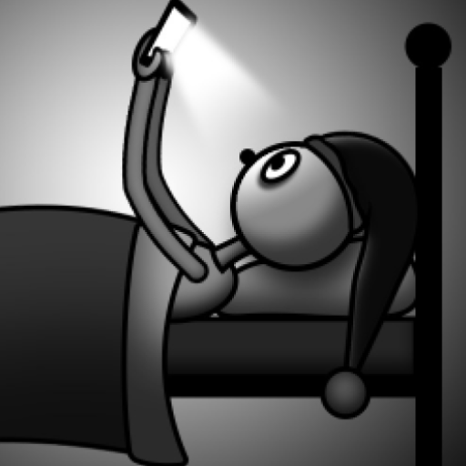

# DontGetUp

<div id="top"></div>
<!--
*** Thanks for checking out the Best-README-Template. If you have a suggestion
*** that would make this better, please fork the repo and create a pull request
*** or simply open an issue with the tag "enhancement".
*** Don't forget to give the project a star!
*** Thanks again! Now go create something AMAZING! :D
-->


<!-- PROJECT SHIELDS -->
<!--
*** I'm using markdown "reference style" links for readability.
*** Reference links are enclosed in brackets [ ] instead of parentheses ( ).
*** See the bottom of this document for the declaration of the reference variables
*** for contributors-url, forks-url, etc. This is an optional, concise syntax you may use.
*** https://www.markdownguide.org/basic-syntax/#reference-style-links
-->
[![Contributors][contributors-shield]][contributors-url]
[![Forks][forks-shield]][forks-url]
[![Stargazers][stars-shield]][stars-url]
[![Issues][issues-shield]][issues-url]
[![MIT License][license-shield]][license-url]


<!-- PROJECT LOGO -->
<br />
<div align="center">
  <a href="https://github.com/csumpakabra/DontGetUp">
    
  </a>

<h3 align="center">Don't Get Up!</h3>

  <p align="center">
    A minimalistic remote controller Android application for your Windows PC.
    <br />
    <a href="https://github.com/csumpakabra/DontGetUp"><strong>Explore the docs »</strong></a>
    <br />
    <br />
    <a href="https://youtu.be/v0EuTl9R020">View Demo</a>
    ·
    <a href="https://github.com/csumpakabra/DontGetUp/issues">Report Bug</a>
    ·
    <a href="https://github.com/csumpakabra/DontGetUp/issues">Request Feature</a>
  </p>
</div>


<!-- TABLE OF CONTENTS -->
<details>
  <summary>Table of Contents</summary>
  <ol>
    <li>
      <a href="#about-the-project">About The Project</a>
      <ul>
        <li><a href="#built-with">Built With</a></li>
      </ul>
    </li>
    <li>
      <a href="#getting-started">Getting Started</a>
      <ul>
        <li><a href="#prerequisites">Prerequisites</a></li>
        <li><a href="#installation">Installation</a></li>
      </ul>
    </li>
    <li><a href="#usage">Usage</a></li>
    <li><a href="#license">License</a></li>
    <li><a href="#contact">Contact</a></li>
    <li><a href="#acknowledgments">Acknowledgments</a></li>
  </ol>
</details>


<!-- ABOUT THE PROJECT -->
## About The Project

The application was created mainly for self-educational purposes. 

The package contains:
* Don't Get Up! Android Application 
* Don't Get Up! Windows Application
* Installer for the Windows Application

To get it working you have to install the Windows Application on your PC and the Android application on your API 24+, Wi-Fi capable device. The two devices have to be on the same LAN.

You can control the Keyboard, Mouse, Volume of your connected PC, or you can just shut it down!

<p align="right">(<a href="#top">back to top</a>)</p>

### Built With

* [Android Studio Bumblebee (2021.1.1) Stable](https://android-developers.googleblog.com/2022/01/android-studio-bumblebee-202111-stable.html)

<p align="right">(<a href="#top">back to top</a>)</p>

<!-- GETTING STARTED -->
## Building


### Prerequisites

* [NSIS](https://nsis.sourceforge.io/Download)
* An installed C++ compiler. See which [C++ tool chains](https://docs.gradle.org/current/userguide/building_cpp_projects.html#sec:cpp_supported_tool_chain) are supported by the cpp-library Gradle plugin
* Set up `JDK_13_HOME` external variable, in the rootproject level [build.gradle](https://github.com/csumpakabra/DontGetUp/blob/main/build.gradle) file to point to the install dir of a [JDK 13+](https://openjdk.java.net/install/)
* Set up `NSIS_HOME` external variable, in the rootproject level [build.gradle](https://github.com/csumpakabra/DontGetUp/blob/main/build.gradle) file to point to the install dir of your [NSIS](https://nsis.sourceforge.io/Download)
  
### Build

1. Clone the repo
   ```sh
   git clone https://github.com/csumpakabra/DontGetUp.git
   ```
2. Build release
   ```sh
   .\gradlew createRelease
   ```

<p align="right">(<a href="#top">back to top</a>)</p>

<!-- LICENSE -->
## License

Distributed under the MIT License. See `LICENSE.md` for more information.

<p align="right">(<a href="#top">back to top</a>)</p>


<!-- CONTACT -->
## Contact

Félegyházi Tamás - felegyhazi.tamas@gmail.com

Project Link: [https://github.com/csumpakabra/DontGetUp](https://github.com/csumpakabra/DontGetUp)

<p align="right">(<a href="#top">back to top</a>)</p>


<!-- MARKDOWN LINKS & IMAGES -->
<!-- https://www.markdownguide.org/basic-syntax/#reference-style-links -->
[contributors-shield]: https://img.shields.io/github/contributors/csumpakabra/DontGetUp.svg?style=for-the-badge
[contributors-url]: https://github.com/csumpakabra/DontGetUp/graphs/contributors
[forks-shield]: https://img.shields.io/github/forks/csumpakabra/DontGetUp.svg?style=for-the-badge
[forks-url]: https://github.com/csumpakabra/DontGetUp/network/members
[stars-shield]: https://img.shields.io/github/stars/csumpakabra/DontGetUp.svg?style=for-the-badge
[stars-url]: https://github.com/csumpakabra/DontGetUp/stargazers
[issues-shield]: https://img.shields.io/github/issues/csumpakabra/DontGetUp.svg?style=for-the-badge
[issues-url]: https://github.com/csumpakabra/DontGetUp/issues
[license-shield]: https://img.shields.io/github/license/csumpakabra/DontGetUp.svg?style=for-the-badge
[license-url]: https://github.com/csumpakabra/DontGetUp/blob/master/LICENSE.txt
[linkedin-shield]: https://img.shields.io/badge/-LinkedIn-black.svg?style=for-the-badge&logo=linkedin&colorB=555
[linkedin-url]: https://linkedin.com/in/linkedin_username

